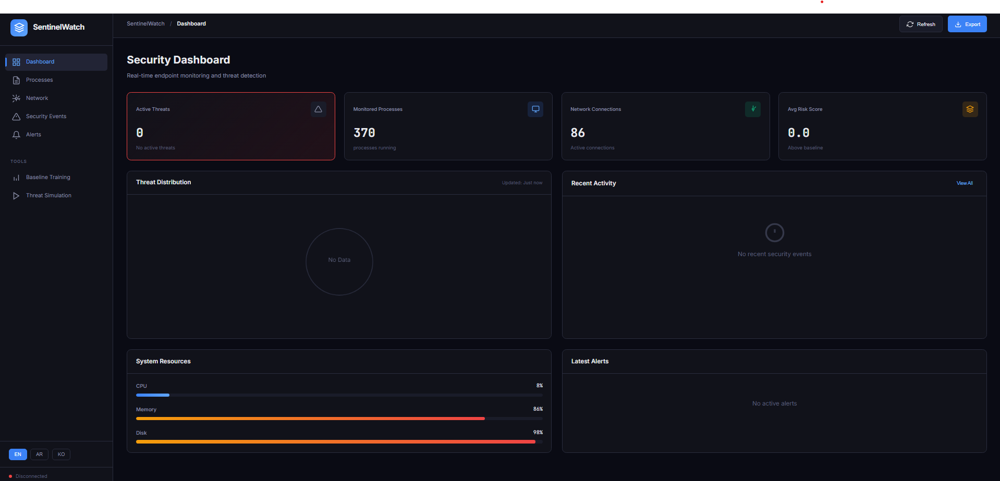

# SentinelWatch

An intelligent endpoint behavior analysis and threat detection system designed for real-time security monitoring. A comprehensive cybersecurity project demonstrating expertise in endpoint protection, behavioral analysis, and machine learning-based threat detection.



## Description

SentinelWatch is a full-stack cybersecurity platform that I developed to showcase practical skills in threat detection, system monitoring, and security analytics. The project addresses a critical challenge in modern cybersecurity: detecting sophisticated threats that bypass traditional signature-based detection by analyzing system behavior in real-time.

The platform continuously monitors endpoint activity including running processes, network connections, and file operations. Using an Isolation Forest machine learning algorithm, it establishes behavioral baselines during normal operation and identifies statistical anomalies that may indicate malware, intrusions, or insider threats. A multi-factor risk scoring engine evaluates suspicious patterns including encoded PowerShell commands, C2 communication signatures, and unusual file access to generate actionable security alerts.

This project demonstrates proficiency across the security engineering stack: Python backend development with FastAPI, real-time data processing with WebSockets, machine learning implementation with scikit-learn, and modern frontend development with vanilla JavaScript and Canvas visualization. The dark-themed interface supports multiple languages and provides security analysts with an intuitive dashboard for threat investigation and incident response.

## Overview

SentinelWatch is a production-ready cybersecurity platform that combines real-time system monitoring, machine learning-based anomaly detection, and comprehensive risk scoring to protect endpoints against evolving threats. The system monitors processes, network connections, and file operations while analyzing behavioral patterns to identify suspicious activities.

## Features

### Core Capabilities

- **Real-time Process Monitoring**: Track all running processes with CPU, memory, and connection metrics
- **Network Connection Analysis**: Monitor active connections with suspicious port detection
- **ML-Powered Anomaly Detection**: Isolation Forest algorithm for behavioral analysis
- **Risk Scoring Engine**: Multi-factor risk assessment with severity classification
- **Interactive Dashboard**: Real-time WebSocket updates with visual analytics
- **Threat Simulation**: Educational testing environment for security validation

### Advanced Features

- **Baseline Training**: Learn normal system behavior for accurate anomaly detection
- **Multi-language Support**: English, Arabic, and Korean interfaces
- **Incident Response**: Automated recommendations with severity-based actions
- **Export Functionality**: JSON export for forensics and reporting
- **Responsive Design**: Dark-mode cybersecurity interface optimized for security operations

## Architecture

```
sentinelwatch/
├── backend/
│   ├── app.py              # FastAPI application and endpoints
│   ├── database.py         # SQLAlchemy models and database operations
│   ├── monitor.py          # System monitoring agent (psutil-based)
│   ├── analyzer.py         # ML anomaly detection (scikit-learn)
│   ├── risk_engine.py      # Risk scoring and classification logic
│   └── utils.py            # Helper functions and utilities
├── frontend/
│   ├── index.html          # Main dashboard interface
│   ├── css/
│   │   └── style.css       # Dark cyber theme styling
│   └── js/
│       ├── app.js          # Main application logic
│       ├── charts.js       # Canvas-based visualization
│       └── i18n.js         # Multi-language translations
├── data/                   # SQLite database storage
├── models/                 # Trained ML model persistence
└── logs/                   # Application logs
```

## Technology Stack

- **Backend**: Python 3.8+, FastAPI, SQLAlchemy, WebSockets
- **Frontend**: Vanilla JavaScript, Canvas API, CSS3
- **ML/Analytics**: scikit-learn (Isolation Forest), NumPy, Pandas
- **Monitoring**: psutil for system metrics
- **Database**: SQLite with SQLAlchemy ORM

## Installation

### Prerequisites

- Python 3.8 or higher
- Windows 10/11 or Linux (psutil compatible)
- 4GB RAM minimum (8GB recommended for training)

### Setup Instructions

1. **Clone or extract the project**:
   ```bash
   cd sentinelwatch
   ```

2. **Create virtual environment**:
   ```bash
   python -m venv venv
   
   # Windows
   venv\Scripts\activate
   
   # Linux/Mac
   source venv/bin/activate
   ```

3. **Install dependencies**:
   ```bash
   pip install -r requirements.txt
   ```

4. **Initialize the database**:
   ```bash
   python -c "from backend.database import init_db; init_db()"
   ```

5. **Start the application**:
   ```bash
   python backend/app.py
   ```

6. **Access the dashboard**:
   Open your browser and navigate to `http://localhost:8000`

## Usage

### First Run

1. The system automatically starts monitoring processes and network connections
2. Navigate to **Baseline Training** to establish normal behavior patterns
3. Allow 5-10 minutes of training during normal system operation
4. The ML model will learn typical process behaviors for accurate detection

### Daily Operations

- **Dashboard**: Monitor overall security posture and system health
- **Processes**: Review running processes with anomaly indicators
- **Network**: Inspect active connections for suspicious activity
- **Security Events**: Investigate detected threats with full details
- **Alerts**: Manage notifications and incident tracking

### Testing Detection

Use the **Threat Simulation** section to validate detection capabilities:
- **Ransomware Simulation**: Tests file encryption pattern detection
- **Backdoor Simulation**: Validates C2 communication identification
- **Trojan Simulation**: Checks process injection detection

These simulations generate synthetic data without executing harmful code.

## How It Works

### Data Collection

The monitor agent uses psutil to collect:
- Process metadata (name, PID, CPU, memory, threads)
- Network connections (local/remote addresses, ports, protocols)
- System resources (CPU, memory, disk utilization)

### Analysis Pipeline

1. **Baseline Training**: Collect normal system behavior samples
2. **ML Analysis**: Isolation Forest detects statistical anomalies
3. **Risk Scoring**: Multi-factor engine evaluates threat indicators:
   - Command line patterns (encoded commands, suspicious arguments)
   - Network destinations (suspicious ports, known C2 infrastructure)
   - File operations (sensitive directory access, extension analysis)
   - Privilege context (elevated operations with suspicious behavior)
   - Temporal patterns (off-hours activity, frequency analysis)

4. **Classification**: Threat categorization (ransomware, trojan, backdoor, cryptominer)
5. **Response**: Severity-based recommendations with automated actions

### Risk Levels

- **Critical (80-100)**: Immediate system isolation required
- **High (60-79)**: Process suspension and security team alert
- **Medium (40-59)**: Enhanced monitoring activated
- **Low (20-39)**: Standard logging maintained
- **Info (0-19)**: Background recording only

## Security & Ethics

### Educational Purpose

SentinelWatch is designed for:
- Cybersecurity education and training
- Portfolio demonstration for security roles
- Research into endpoint detection methodologies
- Testing detection logic in controlled environments

### Ethical Guidelines

This tool:
- **Does NOT** execute any malicious code
- **Does NOT** modify system files or configurations
- **Does NOT** transmit data to external servers
- **ONLY** monitors local system state and logs events locally
- **ONLY** simulates threat data through synthetic indicators

### Responsible Use

- Use only on systems you own or have explicit permission to monitor
- Do not use for unauthorized surveillance
- Threat simulations are clearly labeled and do not harm systems
- Review and comply with local laws regarding security tools

### Data Privacy

All data remains local:
- SQLite database stored in `data/sentinel.db`
- ML models saved to `models/baseline_model.pkl`
- No external connections except localhost monitoring
- Command lines with passwords/tokens are automatically redacted

## API Endpoints

### System Information
- `GET /api/status` - System operational status
- `GET /api/system/resources` - Resource utilization metrics

### Monitoring
- `GET /api/processes` - Active process list with analysis
- `GET /api/network` - Network connection inventory

### Events & Alerts
- `GET /api/events` - Security event history with filtering
- `GET /api/alerts` - Alert management with acknowledgment
- `POST /api/alerts/{id}/acknowledge` - Mark alert as acknowledged

### Analysis
- `POST /api/analyze` - Submit process for risk analysis
- `GET /api/baseline/status` - ML model training status
- `POST /api/baseline/train` - Initiate baseline training

### Simulation
- `POST /api/simulate/{type}` - Generate synthetic threat event

### WebSocket
- `/ws` - Real-time event streaming for live updates

## Multi-language Support

SentinelWatch supports three languages:
- **English (EN)**: Default interface
- **Arabic (AR)**: Right-to-left layout with Arabic translations
- **Korean (KO)**: Korean language interface

Language selection is available in the sidebar and persists during the session.

## Screenshots

### Dashboard

*Real-time security overview with threat distribution and resource monitoring*

## Additional Screenshots

*More screenshots available in the live demo at `http://localhost:8000`*

## Troubleshooting

### Common Issues

**Application won't start**:
- Verify Python 3.8+ is installed: `python --version`
- Check all dependencies installed: `pip list | grep -E "fastapi|psutil|scikit"`
- Ensure port 8000 is available: `netstat -an | findstr 8000`

**No processes showing**:
- Run as administrator (Windows) or with sudo (Linux) for full process visibility
- Check psutil is properly installed: `python -c "import psutil; print(psutil.cpu_percent())"`

**ML training fails**:
- Ensure system is running normally during training (no stress tests)
- Minimum 10 process samples required for training
- Check `models/` directory is writable

**WebSocket disconnected**:
- Verify browser supports WebSocket (Chrome/Firefox/Edge)
- Check firewall isn't blocking localhost connections
- Refresh page to reconnect

## Performance Considerations

- **CPU Usage**: Typically 1-3% during normal monitoring
- **Memory**: Approximately 150-250MB RAM usage
- **Disk**: SQLite database grows with event volume (rotate logs periodically)
- **Network**: No external network usage; internal WebSocket only

## Future Enhancements

Potential improvements for production deployment:
- Integration with SIEM platforms (Splunk, ELK Stack)
- YARA rule integration for signature-based detection
- Memory forensics with Volatility framework
- Email/Slack alerting integration
- Role-based access control (RBAC)
- Audit logging for compliance

## Credits & License

**Author**: Cybersecurity Engineer & Developer  
**Purpose**: Educational portfolio project for cybersecurity graduate studies  
**License**: MIT License - See LICENSE file for details

## Contact & Support

For questions about this project:
- Review the code documentation in `backend/` directory
- Check API documentation at `http://localhost:8000/docs` (FastAPI auto-generated)
- Open an issue in the project repository

---

**Disclaimer**: This software is provided for educational purposes only. The author assumes no liability for misuse or damage caused by this tool. Always ensure proper authorization before deploying security monitoring software.

---

*Built with dedication to advancing cybersecurity education and research.*
